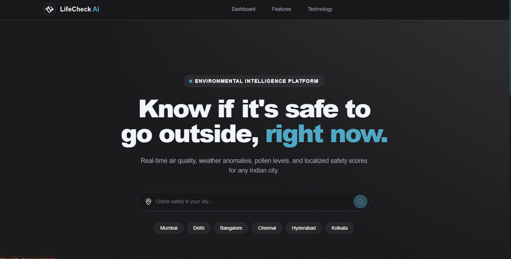
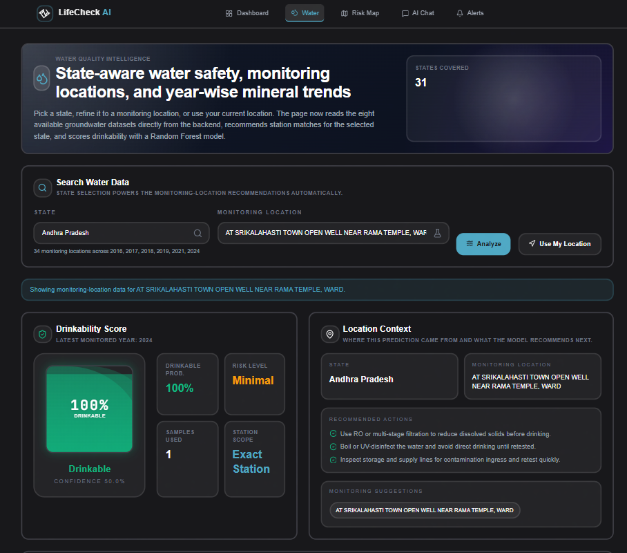
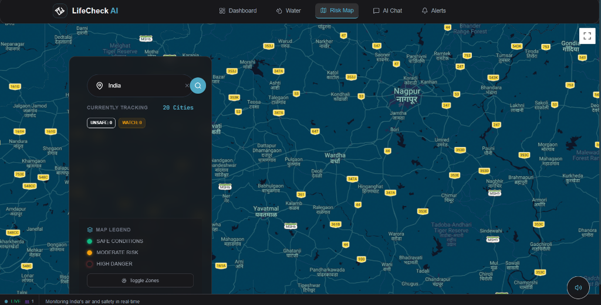
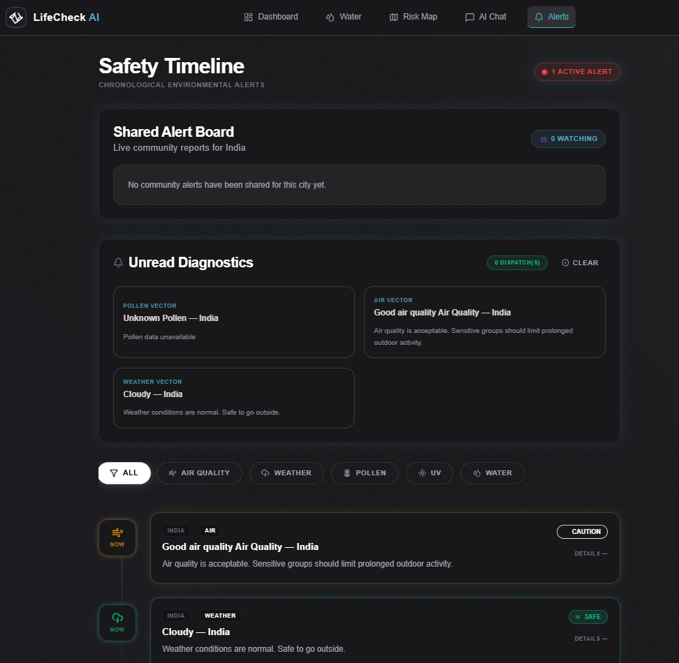
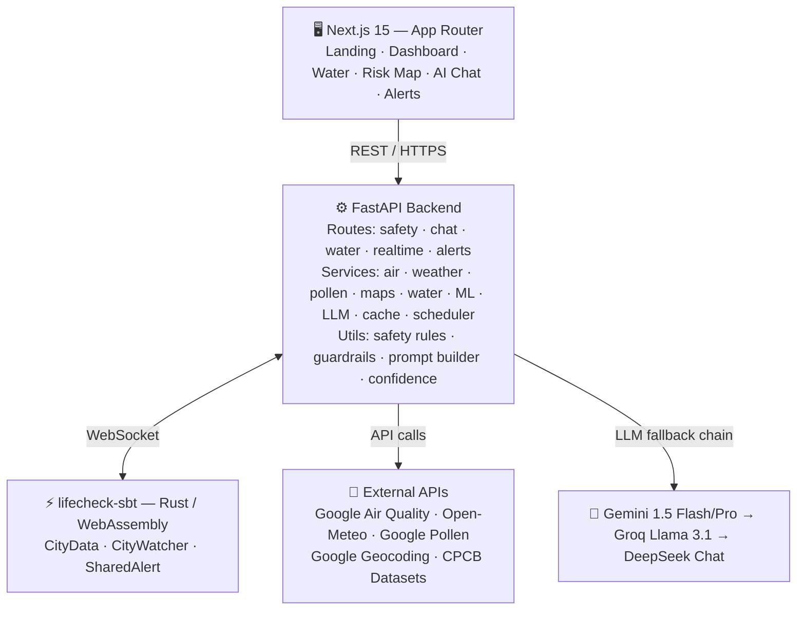

# LifeCheck AI

**Real-time environmental safety intelligence for Indian cities** — combines air quality, weather, pollen, UV, and water safety data into a single composite safety verdict, delivered via a responsive web interface and a conversational AI assistant.

---

## Overview

Most air quality and weather apps surface raw numbers without answering the actual question: *is it safe for me to go outside right now?* LifeCheck AI addresses that gap by aggregating data from multiple environmental data providers, running it through a consistent safety-rules layer, and returning a structured verdict — safe, caution, or unsafe — with actionable guidance.

The platform covers Indian cities specifically. Location resolution uses the Google Maps Geocoding API constrained to the IN region, water quality predictions draw from CPCB monitoring-station datasets, and pollen data is sourced from the Google Pollen API where available. The composite safety score is a weighted function of AQI, temperature, and water quality; it returns `null` rather than defaulting to a nominal value when insufficient data is available to score.

The product consists of a **Next.js 15 App Router frontend** (six core pages: Landing, Dashboard, Water, Risk Map, AI Chat, Alerts) and a **FastAPI backend** that exposes a versioned REST API. The backend maintains an in-process runtime state layer for fast city lookups, persists snapshots via SpaceTimeDB (a Rust/WebAssembly real-time database), and runs a background scheduler that pre-fetches data for a configured list of cities.

---

## Live Demo

[life-check-ai.vercel.app](https://life-check-ai.vercel.app)

---

## Screenshots

| Landing | Water Quality | Risk Map | Alerts |
|---|---|---|---|
|  |  |  |  |

---

## Repository Structure

```
LifeCheckAi/
├── lifecheckai/              # Main application
│   ├── frontend/             # Next.js 15 App Router (6 pages)
│   ├── backend/              # FastAPI REST API + ML + services
│   └── screenshots/          # UI screenshots
│
└── lifecheck-sbt/            # SpaceTimeDB server module (Rust / WebAssembly)
    └── server/               # Tables + reducers for real-time city sync
```

---

## Features

### Air Quality
- AQI fetch and classification (Good → Hazardous) via Google Air Quality API
- Dominant pollutant identification
- PM2.5, PM10, CO, NO₂, Ozone breakdowns
- 24-hour AQI trend chart with historical comparison
- 48-hour forecast using a local linear regression model

### Weather Safety
- Real-time temperature, humidity, UV index, wind speed
- Safety scoring with heat-stress and cold-stress thresholds
- Conditions-based advice (haze, smoke, thunderstorm, etc.)

### Water Quality
- Station-level predictions for 34+ CPCB monitoring locations across Indian states
- Random Forest classifier trained on historical CPCB data (pH, BOD, TDS, nitrates, fecal/total coliform, fluoride, arsenic)
- Confidence scores per prediction; low-confidence locations are flagged
- Year-over-year trend analysis and station ranking
- State-level aggregation with nearest-station matching by coordinates

### AI Chat Assistant
- Natural-language questions about air quality, water safety, UV exposure, pollen, and weather for any city
- Three-provider fallback chain: **Gemini** (1.5 Flash / 1.5 Pro) → **Groq** (Llama 3.1 8B Instant) → **DeepSeek Chat**
- Per-provider error tracking; the active provider and any upstream errors are returned in every response
- Intent detection (air quality, water, weather, general safety, off-topic)
- Safety-rule guardrails aligned with the backend's `/api/safety-rules` endpoint — frontend and backend guardrail logic stay in sync from the same source
- Streaming response support via `/api/ask/stream`
- Structured response schema: intent, location, answer sections, confidence score, source citations, follow-up prompts, provider metadata

### Risk Map
- Google Maps base layer with city status markers (safe/caution/unsafe/unknown)
- Live city data pulled from SpaceTimeDB runtime state
- Search with location suggestions (geocoding-backed autocomplete)
- Community crowd reports with upvote support
- Shared user presence indicators (active viewers per city)
- Layer toggles: AQI overlay, community markers, realtime presence

### Alerts
- Shared community alert board (global feed)
- Priority alert banner for critical conditions
- Alert subscription management by city
- Alert timeline with severity classification (info / warning / critical)
- Voice briefing integration (optional ElevenLabs TTS)

### Background Scheduler
- Configurable city list refreshed every N seconds (default: 300)
- File-lock guard prevents multiple workers from running duplicate refresh cycles
- ML model warm-up at startup to eliminate cold-start latency on first request

---

## Architecture



### Safety Rules Synchronization

The `/api/safety-rules` endpoint returns the same thresholds and classification logic used internally by the backend. The frontend fetches this on load to ensure UI-level safety classifications (green/amber/red) remain consistent with backend verdicts — there is no duplicated hard-coded threshold table in the frontend.

---


## Tech Stack

### Frontend
| Package | Version | Purpose |
|---|---|---|
| Next.js | 16.2.2 | App Router framework |
| React | 19.2.4 | UI rendering |
| Framer Motion | 12.x | Animation (critically-damped spring physics) |
| Tailwind CSS | 3.4.x | Utility-first styling |
| Recharts | 3.x | AQI / water trend charts |
| Chart.js + react-chartjs-2 | 4.x / 5.x | Additional chart types |
| Lucide React | 1.x | Icon set |
| Zustand | 5.x | Local UI state |
| spacetimedb (JS SDK) | 2.x | Real-time city presence |

### Backend
| Package | Version | Purpose |
|---|---|---|
| FastAPI | 0.135.x | REST API framework |
| Uvicorn | 0.42.x | ASGI server (dev) |
| Gunicorn | 23.x | Process manager (production) |
| Pydantic | 2.12.x | Request/response validation |
| httpx | 0.28.x | Async HTTP client |
| pymongo | 4.16.x | MongoDB driver |
| python-dotenv | 1.2.x | Environment variable loading |

### AI & ML
| Package / Service | Purpose |
|---|---|
| google-generativeai 0.8.x | Gemini 1.5 Flash / Pro (primary LLM) |
| Groq API (llama-3.1-8b-instant) | LLM fallback 1 |
| DeepSeek API (deepseek-chat) | LLM fallback 2 |
| scikit-learn ≥ 1.5 | Random Forest water quality classifier |
| pandas ≥ 2.2 | CPCB dataset loading and feature engineering |
| numpy ≥ 1.26 | Numerical operations |
| joblib ≥ 1.4 | Model serialization |

### Real-time (SpaceTimeDB module)
| | |
|---|---|
| Language | Rust (edition 2021) |
| Crate | `spacetimedb` v2.1.0 |
| Output | `cdylib` compiled to WebAssembly |
| Tables | `CityData`, `CityWatcher`, `SharedAlert` |
| Reducers | `save_city_data`, `join_city`, `leave_city`, `push_alert` |

### Data Sources
| Service | Purpose |
|---|---|
| Google Air Quality API | AQI, pollutant breakdown |
| Google Pollen API | Pollen type/level by location |
| Google Geocoding / Places API | City coordinate resolution, autocomplete |
| Open-Meteo | Weather (temperature, UV, wind, humidity) |
| CPCB monitoring datasets | Water quality historical data (offline files) |

### Infra
- **Frontend**: Vercel (Next.js native deployment)
- **Backend**: Any ASGI-compatible host (Gunicorn + Uvicorn workers)
- **SpaceTimeDB**: Self-hosted or SpaceTimeDB Cloud

---

## Getting Started

### Prerequisites

- Node.js ≥ 20
- Python 3.12
- Rust + `spacetimedb` CLI (only if deploying the SBT module)
- API keys (see [Environment Variables](#environment-variables))

### Clone

```bash
git clone https://github.com/SHREESHANTH99/LifeCheckAi.git
cd LifeCheckAi
```

### Frontend

```bash
cd lifecheckai/frontend
npm install
npm run dev
```

The dev server starts at `http://localhost:3000`.

### Backend

```bash
cd lifecheckai/backend
python -m venv venv

# Windows
venv\Scripts\activate
# macOS / Linux
source venv/bin/activate

pip install -r requirements.txt
```

Run from the **repository root** (`LifeCheckAi/`), not from inside the `backend/` directory:

```bash
uvicorn lifecheckai.backend.app.main:app --reload --host 0.0.0.0 --port 8000
```

Interactive API docs: `http://localhost:8000/docs`

### SpaceTimeDB Module (optional)

```bash
cd lifecheck-sbt/server

# Build
cargo build --release

# Publish to a SpaceTimeDB instance
spacetimedb publish --server <your-host> lifecheck
```

If `SPACETIMEDB_HOST` is not set, the backend operates without real-time sync. All safety data features remain functional; only live city presence and crowd reports are unavailable.

---

## Environment Variables

### Backend (`lifecheckai/backend/.env`)

| Variable | Required | Default | Description |
|---|---|---|---|
| `GEMINI_API_KEY` | Yes* | — | Google Gemini API key (primary LLM) |
| `GOOGLE_API_KEY` | Yes* | — | Google API key for Geocoding, Air Quality, Pollen; also used as Gemini fallback |
| `GROQ_API_KEY` | No | — | Enables LLM fallback 1 (Groq / Llama 3.1) |
| `DEEPSEEK_API_KEY` | No | — | Enables LLM fallback 2 (DeepSeek Chat) |
| `GEMINI_MODEL` | No | `gemini-1.5-flash` | Override default Gemini model |
| `GROQ_MODEL` | No | `llama-3.1-8b-instant` | Override Groq model |
| `DEEPSEEK_MODEL` | No | `deepseek-chat` | Override DeepSeek model |
| `SPACETIMEDB_HOST` | No | — | SpaceTimeDB host URL; real-time features disabled if unset |
| `SPACETIMEDB_DB_NAME` | No | `lifecheck` | SpaceTimeDB database name |
| `ENABLE_SCHEDULER` | No | `true` | Set to `false` to disable background city refresh |
| `SCHEDULER_INTERVAL_SECONDS` | No | `300` | Refresh frequency in seconds |
| `SCHEDULER_CITIES` | No | `Delhi,Mumbai,Bangalore,Chennai` | Comma-separated cities to pre-fetch |
| `ALLOWED_ORIGINS` | No | `http://localhost:3000,...` | CORS-allowed origins |
| `GEOCODING_COUNTRY` | No | `IN` | ISO country code for geocoding bias |

\* At least one of `GEMINI_API_KEY` or `GOOGLE_API_KEY` is required.

### Frontend (`lifecheckai/frontend/.env.local`)

| Variable | Required | Description |
|---|---|---|
| `NEXT_PUBLIC_API_BASE_URL` | No | Backend base URL (default: `http://127.0.0.1:8000`) |
| `NEXT_PUBLIC_GOOGLE_MAPS_API_KEY` | No | Google Maps JS API key; Risk Map requires this |
| `NEXT_PUBLIC_ELEVENLABS_API_KEY` | No | ElevenLabs key; voice briefing hidden if unset |

---

## API Reference

Interactive docs available at `/docs` on any running backend instance.

| Method | Endpoint | Description |
|---|---|---|
| `GET` | `/api/check-safety` | Full safety snapshot for a city by name (`?city=`) |
| `GET` | `/api/check-safety-by-coordinates` | Safety snapshot by lat/lon (`?lat=&lon=`) |
| `GET` | `/api/cities/live` | Live snapshots for all cached cities |
| `GET` | `/api/location-suggestions` | Geocoding-backed autocomplete (`?q=&limit=`) |
| `GET` | `/api/ask` | AI chat response for a safety question (`?query=`) |
| `GET` | `/api/ask/stream` | Streaming version of `/api/ask` |
| `GET` | `/api/safety-rules` | Safety classification thresholds used by the backend |
| `GET` | `/predict` | Water quality prediction for a state/station |
| `GET` | `/trends` | Year-over-year trend data for a monitoring station |
| `GET` | `/states` | Available Indian states in the water dataset |
| `GET` | `/stations` | Monitoring stations for a given state |
| `GET` | `/analyze` | Detailed water parameter analysis for a location |
| `GET` | `/alerts/live` | Current shared alert feed |
| `GET` | `/presence` | Active user presence data by city |
| `GET` | `/crowd-reports` | Community-submitted environmental reports |
| `GET` | `/history` | Historical safety snapshot log |
| `GET` | `/health` | Backend health check |

---

## Known Limitations

- **Water prediction confidence varies by location.** Some CPCB monitoring stations have limited historical records; predictions at these locations carry lower confidence scores and are flagged as such. Treat them as indicative, not authoritative.
- **Pollen data is unavailable for many cities.** The Google Pollen API has limited Indian city coverage. When pollen data is absent, pollen-related fields are omitted from the safety verdict rather than defaulting to a nominal value.
- **Scheduler is single-worker only.** The background refresh loop uses a file-based lock to prevent duplicate runs on a single host. It is not designed for multi-process or multi-host deployments. Disable the scheduler (`ENABLE_SCHEDULER=false`) in that configuration and handle city pre-fetching externally.
- **AQI forecasting is approximate.** The 48-hour AQI forecast uses a local linear regression model, not a trained meteorological model. It is useful for trend direction but not a precise forecast.
- **No user authentication.** Crowd reports and alert subscriptions are session-local and not tied to persistent user identities.
- **SpaceTimeDB multi-worker limitation.** The SBT module itself is stateless (WebAssembly); the limitation is in the Python scheduler lock, not in SpaceTimeDB.

---

## Contributing

1. Fork the repository: `https://github.com/SHREESHANTH99/LifeCheckAi`
2. Create a feature branch: `git checkout -b feat/your-feature`
3. Make your changes with clear, focused commits
4. Open a pull request against `main` with a description of what changed and why

Run `npm run lint` (frontend) before submitting. For backend changes, verify the FastAPI app starts cleanly with `uvicorn lifecheckai.backend.app.main:app --reload`.

---

## License

MIT License. See `LICENSE` for details.
