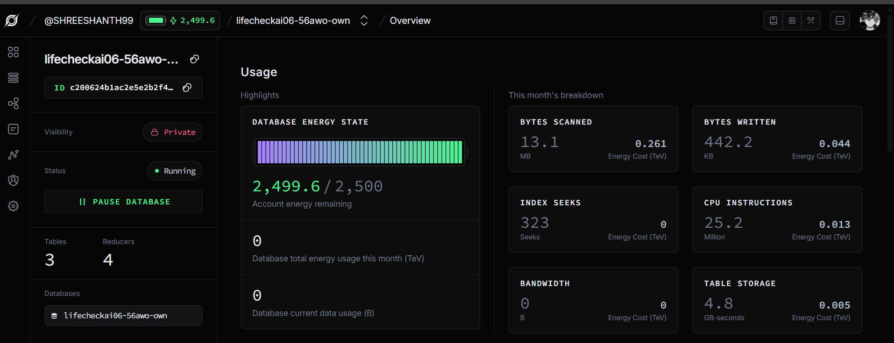
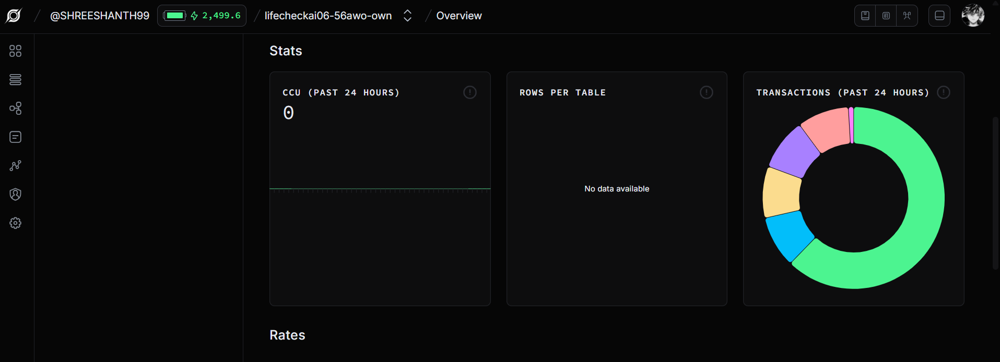
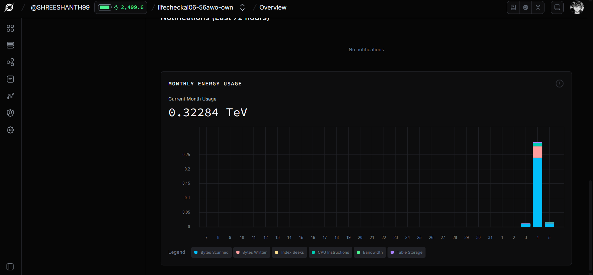

# LifeCheck AI Monorepo

This repository contains two tightly connected projects:

- `lifecheckai/` -> Product app (FastAPI backend + Next.js frontend + ML + AI + voice)
- `lifecheck-sbt/` -> SpaceTimeDB Rust module (`cdylib`) for shared realtime state

This root README is the complete top-level guide for architecture, tracks, implementation details, and demo narration.

## 1) Monorepo Structure

```text
lifecheck-ai/
  lifecheckai/
    backend/
    frontend/
    data/
    models/
    README.md
  lifecheck-sbt/
    server/
      Cargo.toml
      src/lib.rs
  render.yaml
  requirements.txt
```

## 2) What the Platform Does

LifeCheck AI is a full-stack environmental intelligence platform focused on India-first safety decisions.

It answers one practical question: **Is this location safe right now, and what should I do next?**

The platform combines live environment signals, AI guidance, map intelligence, alerts, water-quality ML, realtime shared state, and voice-first interaction.

### Core Capabilities

- **Live city safety checks:** AQI/weather/pollen/UV aware interpretation with verdict-oriented output
- **AI chat with guardrails:** Streaming responses with visible safety rules and policy enforcement
- **Map intelligence:** Spatial risk visualization with crowd risk reports and monitoring
- **Water quality prediction:** ML-backed drinkability assessment with BIS compliance analysis
- **Shared realtime awareness:** Live watcher counts and alerts across connected users
- **Voice-first interaction:** Dashboard briefing, chat voice mode, and proactive spoken alerts

### Product Surfaces

- Fast safety checks for city-level decisions
- Guided dashboard for daily monitoring
- Spatial risk understanding on maps
- Streaming AI assistant for actionable guidance
- Alerting workflow with severity and unread state
- Water-quality prediction and compliance diagnostics
- Realtime shared awareness and watcher presence
- Voice-assisted interaction and spoken summaries

## 3) Feature Tracks Overview

- Track 1: **SpaceTimeDB** - Multiplayer shared state engine
- Track 2: **ArmorIQ** - Transparent AI safety policy layer
- Track 3: **Google Gemini** - Multi-surface AI integration
- Track 4: **ElevenLabs** - Voice-first interaction channels

---

## 4) Detailed Feature Tracks

### Track A: Location Intelligence

**Description:** Multi-modal location search and context discovery.

Features:
- Search by city, district, state, and common India place names
- Ranked suggestion endpoint for quick selection
- Browser geolocation support for current-location checks
- Reverse geocoding support in coordinate-based safety checks
- Input normalization for stable city matching
- Metadata indicating whether values are fresh, fallback, or cached

**Code locations:**
- Backend: `lifecheckai/backend/app/routes/safety.py` (location suggestions)
- Backend: `lifecheckai/backend/app/services/geocode_service.py` (geocoding)
- Frontend: `lifecheckai/frontend/lib/indiaLocations.ts` (location utilities)

---

### Track B: Safety Snapshot and Risk Scoring

**Description:** Unified real-time environmental assessment with verdict-oriented interpretation.

Features:
- Unified safety snapshot for a location
- Verdict-oriented output (safe/caution/unsafe style interpretation)
- Composite interpretation from:
  - Air quality signal (AQI)
  - Weather signal (temperature, wind, precipitation)
  - Pollen signal (when available)
  - UV signal (when available)
- Human-readable advisory text for immediate action
- Null-safe backend assembly to avoid crashes on missing provider fields
- Snapshot persistence support for history and timeline displays

**Code locations:**
- Backend: `lifecheckai/backend/app/services/weather_service.py`
- Backend: `lifecheckai/backend/app/services/air_service.py`
- Backend: `lifecheckai/backend/app/routes/safety.py` (snapshot assembly)
- Frontend: `lifecheckai/frontend/lib/water.ts` (prediction handling)

---

### Track C: AI Assistant (Chat)

**Description:** Natural language environmental guidance with streaming responses and safety guardrails.

Features:
- Natural language environmental guidance
- Query-to-location extraction path (understand context from user intent)
- Intent-aware prompt shaping for safety use-cases
- Streaming response mode for faster perceived latency
- Guardrails for unsafe or unsupported requests
- Structured response sections (summary, risks, actions)
- Provider strategy with fallback chain:
  - Gemini (preferred when available)
  - Groq (operational continuity)
  - DeepSeek (additional fallback)
  - Template fallback if all providers fail

**Code locations:**
- Backend: `lifecheckai/backend/app/routes/chat.py` (streaming responses)
- Backend: `lifecheckai/backend/app/services/chat_service.py` (AI orchestration)
- Backend: `lifecheckai/backend/app/models/chat_model.py` (model integration)
- Frontend: `lifecheckai/frontend/hooks/useStreamingChat.ts` (client-side streaming)

---

### Track D: Dashboard Intelligence

**Description:** Monitored city overview with risk visualization and trend awareness.

Features:
- City search and monitored city workflow
- Risk summary cards with core metrics
- AQI and condition-focused visualization blocks
- Personal risk profile support for interpretation context
- Timeline-style view for trend awareness
- Live refresh controls for monitored locations
- Voice briefing entry points integrated into dashboard flow
- Realtime watcher count updates

**Code locations:**
- Frontend: `lifecheckai/frontend/app/dashboard` (dashboard pages)
- Frontend: `lifecheckai/frontend/components/dashboard` (dashboard components)
- Frontend: `lifecheckai/frontend/hooks/useSharedCityState.ts` (watcher integration)

---

### Track E: Map and Spatial Risk

**Description:** Geo-spatial visualization of environmental risks with crowd activity awareness.

Features:
- Google Maps integration for location context
- Marker and zone-style risk visualization
- Monitored city visibility from map surface
- User-activity and crowd-report style layer support
- Sidebar/drawer interaction pattern for desktop/mobile parity
- Zone visibility toggles for clutter control
- Real-time activity markers from shared state

**Code locations:**
- Frontend: `lifecheckai/frontend/app/map` (map pages)
- Frontend: `lifecheckai/frontend/components/map` (map components)
- Frontend: `lifecheckai/frontend/hooks/useRealtime.ts` (activity integration)

---

### Track F: Alerts and Notification Workflow

**Description:** Real-time alert generation with severity-based prioritization and unread tracking.

Features:
- Live alert feed generation from safety context
- Category-aware filtering (air/weather/pollen/UV/water)
- Severity-based styling to prioritize critical items
- Local unread tracking persistence
- Read and mark-as-read interaction model
- Summary strip for high-priority status
- Proactive spoken alert option via voice

**Code locations:**
- Frontend: `lifecheckai/frontend/app/alerts` (alerts pages)
- Backend: `lifecheckai/backend/app/routes/alerts.py` (alert generation)

---

### Track G: Water Quality ML Intelligence

**Description:** ML-powered water safety assessment with compliance analysis and remediation guidance.

Features:
- State-first filtering with optional district/city refinement
- Drinkability prediction endpoint with confidence scores
- Confidence and class-probability output
- BIS IS 10500:2012 compliance/violation interpretation
- Parameter-level exposure (pH, TDS, nitrate, fluoride, arsenic, etc.)
- Historical trend support by state/location
- AI-generated contamination analysis and remediation suggestions
- Model metrics endpoint for transparency
- Trend visualization and nearby station flow

**Code locations:**
- Frontend: `lifecheckai/frontend/app/water` (water pages)
- Frontend: `lifecheckai/frontend/components/water` (water components)
- Backend: `lifecheckai/backend/app/routes/water.py` (water API)
- Backend: `lifecheckai/backend/app/models/safety_model.py` (ML model)
- Data: `lifecheckai/backend/data/` (training datasets)

---

### Track H: Realtime Shared State and Social Context

**Description:** Multiplayer awareness patterns via SpaceTimeDB with fallback to FastAPI realtime.

Features:
- SpaceTimeDB integration for shared city state patterns
- Shared watcher-count behavior for selected city contexts
- Shared alert board pattern for collaborative awareness
- Realtime snapshot endpoint for current-state consumers
- Polling support for continuously monitored cities
- Scheduler warmup for important cities
- Crowd reporting and activity feed
- User presence and live activity markers

**Code locations:**
- Backend: `lifecheckai/backend/app/services/db_service.py` (SpaceTimeDB write bridge)
- Backend: `lifecheckai/backend/app/routes/realtime.py` (realtime endpoints)
- Frontend: `lifecheckai/frontend/lib/spacetime-db.ts` (table/reducer hooks)
- Frontend: `lifecheckai/frontend/hooks/useSharedCityState.ts` (watcher aggregation)
- Frontend: `lifecheckai/frontend/hooks/useRealtime.ts` (realtime polling)
- Rust module: `lifecheck-sbt/server/src/lib.rs` (SpaceTimeDB schema)

---

### Track I: Voice Assistant and Audio UX

**Description:** Multi-channel voice interaction with ElevenLabs TTS and browser speech fallback.

Features:
- Voice settings persisted in browser local storage
- Default voice modes set to OFF for user control
- Chat voice mode flow:
  - Assistant intro prompt
  - User speaks (audio input)
  - Assistant responds with voice (audio output)
  - Loop continues for conversational hands-free use
- ElevenLabs TTS primary path (adam voice, multilingual_v2 model)
- Browser speech-synthesis fallback when ElevenLabs unavailable
- Voice waveform feedback during active speech mode
- Dashboard spoken safety briefing
- Proactive spoken alert support
- Automatic turn-taking in voice conversations

**Code locations:**
- Frontend: `lifecheckai/frontend/components/voice` (voice components)
- Frontend: `lifecheckai/frontend/lib/elevenlabs-voice.ts` (voice synthesis)
- Frontend: `lifecheckai/frontend/lib/elevenlabs.ts` (ElevenLabs API)
- Frontend: `lifecheckai/frontend/hooks/useChatVoiceMode.ts` (voice mode logic)
- Frontend: `lifecheckai/frontend/hooks/useProactiveVoiceAlerts.ts` (proactive alerts)

## 5) Core Technology Tracks

### Track 1: SpaceTimeDB - Multiplayer State Engine

**One-line pitch:** "SpaceTimeDB is the multiplayer state engine of our product."

#### Schema and Tables

Located at: `lifecheck-sbt/server/src/lib.rs`

Current tables:
- `city_data` - Snapshot of safety metrics for tracked cities
- `city_watcher` - Tracking which users are monitoring which cities
- `shared_alert` - Broadcast alerts across all connected clients

Current reducers:
- `save_city_data` - Persist city safety metrics
- `join_city` - Register user as watcher for a city
- `leave_city` - Unregister user from city monitoring
- `push_alert` - Broadcast alert to all clients


#### Frontend Integration

The frontend consumes SpaceTimeDB through several layers:

**Table/Reducer hooks:**
- File: `lifecheckai/frontend/lib/spacetime-db.ts`
- Exposes hooks for subscribing to tables and calling reducers
- Handles connection state and subscription management

**Watcher aggregation:**
- File: `lifecheckai/frontend/hooks/useSharedCityState.ts`
- Aggregates `city_watcher` table to compute live watcher count for monitored city
- Updates dashboard in real-time as users join/leave

**User experience:**
- Live watcher count displayed on dashboard
- Shared alerts reflected quickly across all connected clients
- Consistent reducer-enforced writes rather than client-only state mutation
- Guarantees all clients see same state via SpaceTimeDB consistency model

#### Backend Integration

**DB write bridge:**
- File: `lifecheckai/backend/app/services/db_service.py`
- Provides interfaces for backend to write to SpaceTimeDB tables
- Ensures backend updates propagate to frontend subscriptions

#### Crowd Reports and Realtime Features

Current crowd features are served through FastAPI realtime endpoints:
- File: `lifecheckai/backend/app/routes/realtime.py`
- File: `lifecheckai/frontend/lib/spacetime.ts`
- File: `lifecheckai/frontend/hooks/useRealtime.ts`

These include crowd upvote endpoint and map activity markers. This is a valid realtime feature today and a clear migration candidate into SpaceTimeDB tables/reducers if needed.

#### Deployment

- **Target:** SpaceTimeDB maincloud database `lifecheckai06-56awo-own`
- **Deploy command:** `spacetime publish` from `lifecheck-sbt/server`
- **Status:** Actively synced with 3 tables live

#### Demo Script Segment

1. Open dashboard on two separate devices for the same city
2. Show watcher count increment in real-time as second client joins
3. Trigger an alert from the backend
4. Verify both clients receive alert simultaneously
5. Close one client and confirm watcher count decrements

#### SpaceTimeDB Screenshots

Place your three screenshots here:

- `lifecheckai/docs/images/tracks/spacetimedb-overview-1.png`
- `lifecheckai/docs/images/tracks/spacetimedb-overview-2.png`
- `lifecheckai/docs/images/tracks/spacetimedb-overview-3.png`

Rendered section:





---

### Track 2: ArmorIQ - Transparent Safety Policy Layer

**One-line pitch:** "ArmorIQ in this product is a transparent policy layer, not a hidden moderation toggle."

#### User-Facing Policy Panel

**Primary component:** `lifecheckai/frontend/components/agent/AgentRulesPanel.tsx`

**Mounted in:** Chat sidebar agent tab (`lifecheckai/frontend/components/chat/ChatSidebar.tsx`)

Panel displays:

- **Allowed capabilities** - List of actions the assistant is permitted to execute
- **Blocked actions** - List of unsafe or unsupported request categories
- **Live action log** - Real-time stream of each assistant decision (ALLOWED/BLOCKED) with reasoning
- **Confidence visualization** - Strip showing how confident the model is in its interpretation

#### Backend Safety Behavior

**Safety flow:**
- File: `lifecheckai/backend/app/models/safety_model.py`
- File: `lifecheckai/backend/app/routes/chat.py`

Behavior:
1. Chat request arrives with user query and context
2. Safety model runs first, classifying intent and checking boundaries
3. If blocked, returns safe, useful fallback guidance
4. If allowed, forwards to Gemini/Groq/DeepSeek for response generation
5. UI clearly marks all interactions to preserve trust

#### Why This Satisfies Track Intent

- Rules are visible to users (not hidden)
- Allowed and blocked decisions are observable in the panel
- Safety boundaries are explicit and consistent
- Users can predict which queries will be assisted vs. declined
- Fallback guidance is useful even when requests are blocked

#### Policy Categories

Current guardrails enforce:
- Medical advice boundaries (safe health context vs. diagnosis claims)
- Safety-first intent classification (genuine vs. exploratory)
- Location-specific applicability (India-focused platform constraints)
- Use-case alignment (environmental safety focus)

---

### Track 3: Google Gemini - Multi-Surface AI Integration

**One-line pitch:** "Gemini is integrated across multiple product paths: chat, water analysis, forecast narration, and intent extraction."

#### Meaningful Integrations

1. **Streaming chat generation**
   - File: `lifecheckai/backend/app/routes/chat.py`
   - Provides safety-assisted streaming responses to user questions
   - Model: `gemini-2.5-flash`

2. **Water contamination narrative**
   - File: `lifecheckai/backend/app/routes/water.py`
   - Generates human-readable explanations for water quality findings
   - Converts raw model outputs into actionable remediation context

3. **Forecast and advisory text**
   - File: `lifecheckai/backend/app/services/` (safety/chat services)
   - Generates trend summaries and weather-context narratives
   - Powers dashboard briefing content

4. **Intent and location extraction**
   - File: `lifecheckai/backend/app/models/chat_model.py`
   - Parses user queries to extract geographic and intent context
   - Handles ambiguous queries with smart defaults

#### Reliability Model

**Provider fallback chain:**
1. **Gemini** (primary) - `gemini-2.5-flash` model
2. **Groq** (fallback) - `llama-3.1-8b-instant` model
3. **DeepSeek** (secondary fallback) - `deepseek-chat` model
4. **Template** (graceful degradation) - Pre-built response if all fail

**User impact:**
- No hard failures even during provider outages
- Quality gracefully degrades rather than breaking the product
- Scheduler can trigger warmup requests to preempt degradation

#### Configuration

Backend .env:
```
GEMINI_API_KEY=YOUR_KEY
GEMINI_MODEL=gemini-2.5-flash
GROQ_API_KEY=YOUR_KEY
GROQ_MODEL=llama-3.1-8b-instant
DEEPSEEK_API_KEY=YOUR_KEY
DEEPSEEK_MODEL=deepseek-chat
```

---

### Track 4: ElevenLabs - Voice-First Interaction

**One-line pitch:** "Voice is a first-class interaction channel with multiple real user flows."

#### Implemented Voice Features

1. **Dashboard spoken briefing**
   - File: `lifecheckai/frontend/components/dashboard`
   - Click-to-speak for safety summary
   - Automatically narrates key metrics and recommendations

2. **Chat voice mode**
   - File: `lifecheckai/frontend/hooks/useChatVoiceMode.ts`
   - Conversational loop: speak → AI responds → AI voice reads answer → ready for next input
   - Hands-free interaction suitable for eyes-busy scenarios

3. **Proactive spoken alerts**
   - File: `lifecheckai/frontend/hooks/useProactiveVoiceAlerts.ts`
   - High-priority alerts read aloud automatically
   - Can be enabled/disabled in settings

4. **Browser speech fallback**
   - File: `lifecheckai/frontend/lib/elevenlabs.ts`
   - Uses browser Web Speech API if ElevenLabs unavailable
   - Ensures voice never breaks the platform

#### Technical Strengths

- **Persistent voice preferences** stored in browser local storage
- **Automatic turn-taking** in chat voice mode (API determines when response is complete)
- **Graceful degradation** to browser speech if external service fails
- **Waveform feedback** during active speech to give audio-only users confidence
- **Multilingual support** via ElevenLabs multilingual_v2 model
- **Natural voice** from ElevenLabs adam voice preset

#### Configuration

Frontend .env.local:
```
NEXT_PUBLIC_ELEVENLABS_API_KEY=YOUR_KEY
NEXT_PUBLIC_ELEVENLABS_VOICE_ID=YOUR_VOICE_ID
```

#### Demo Script Segment

1. Open dashboard and click voice briefing button
2. Hear the spoken safety summary for the city
3. Go to chat, enable voice mode
4. Speak a question like "Is it safe to go outside?"
5. Hear the streamed response read aloud automatically
6. Ask a follow-up question; loop continues naturally
7. Disable voice mode and show the same query works in text

---

## 10) Technology Stack

### Frontend Dependencies

| Package | Version | Purpose |
|---------|---------|---------|
| next | 16.2.2 | React framework with App Router |
| react | 19.2.4 | UI library |
| typescript | 5 | Type safety |
| tailwindcss | 3.4.x | Utility CSS |
| framer-motion | 12.x | Animations and transitions |
| recharts | 3.x | Data visualization |
| chart.js | 4.x | Additional charting |
| zustand | 5.x | State management |
| spacetimedb | 2.1.0 | Realtime database client |

### Backend Dependencies

| Package | Version | Purpose |
|---------|---------|---------|
| fastapi | 0.135.x | Web framework |
| uvicorn | 0.42.x | ASGI server |
| pydantic | 2.12.x | Data validation |
| python-dotenv | 1.2.x | Environment configuration |
| google-generativeai | 0.8.x | Gemini API |
| httpx | 0.28.x | HTTP client |
| requests | 2.33.x | HTTP library |
| pandas | 2.2+ | Data manipulation |
| scikit-learn | 1.5+ | ML models |
| joblib | 1.4+ | Model serialization |
| numpy | 1.26+ | Numerical computing |

### Realtime Companion (Rust/SpaceTimeDB)

| Component | Version |
|-----------|---------|
| Rust edition | 2021 |
| spacetimedb | 2.1.0 |
| Compile target | wasm32-unknown-unknown |

---

## 11) Environment Configuration and Setup

### Backend Configuration

Create `lifecheckai/backend/.env`:

```env
# API Keys
GOOGLE_API_KEY=YOUR_GOOGLE_MAPS_API_KEY
GEMINI_API_KEY=YOUR_GEMINI_KEY
GEMINI_MODEL=gemini-2.5-flash
GROQ_API_KEY=YOUR_GROQ_KEY
GROQ_MODEL=llama-3.1-8b-instant
DEEPSEEK_API_KEY=YOUR_DEEPSEEK_KEY
DEEPSEEK_MODEL=deepseek-chat

# Geocoding config
GEOCODING_COUNTRY=IN
GEOCODING_REGION=in

# SpaceTimeDB config
SPACETIMEDB_HOST=https://maincloud.spacetimedb.com
SPACETIMEDB_DB_NAME=lifecheckai06-56awo-own

# Scheduler config
ENABLE_SCHEDULER=true
SCHEDULER_INTERVAL_SECONDS=300
SCHEDULER_CITIES=Delhi,Mumbai,Bangalore,Chennai,Hyderabad
```

### Frontend Configuration

Create `lifecheckai/frontend/.env.local`:

```env
NEXT_PUBLIC_API_URL=http://127.0.0.1:8000
NEXT_PUBLIC_API_BASE_URL=http://127.0.0.1:8000
NEXT_PUBLIC_GOOGLE_MAPS_API_KEY=YOUR_BROWSER_MAPS_KEY
NEXT_PUBLIC_ELEVENLABS_API_KEY=YOUR_ELEVENLABS_KEY
NEXT_PUBLIC_ELEVENLABS_VOICE_ID=adam
```

### Local Development Setup

**Backend:**

```powershell
cd lifecheckai/backend
python -m venv venv
.\venv\Scripts\activate
pip install -r requirements.txt
python -m app.main  # or uvicorn app.main:app --reload
```

**Frontend:**

```powershell
cd lifecheckai/frontend
npm install
npm run dev  # starts on http://localhost:3000
```

**SpaceTimeDB module (optional):**

```powershell
cd lifecheck-sbt/server
spacetime publish  # requires spacetime CLI installed
```

---

## 12) Production Deployment

### Frontend

Deploy `lifecheckai/frontend` to **Vercel**:
- Push to GitHub repository
- Vercel auto-detects Next.js
- Environment variables configured in Vercel dashboard
- CDN deployed globally

### Backend

Deploy `lifecheckai/backend` to **Render**:
- Push to GitHub repository
- Configure Python buildpack
- Set environment variables on Render dashboard
- Scheduler runs on primary dyno

### Realtime Database

- SpaceTimeDB module deployed to **Maincloud**
- Database: `lifecheckai06-56awo-own`
- Tables live and subscribed by frontend clients
- CLI push via `spacetime publish`

---

## 13) Demo Script (Comprehensive)

## 11) Source-of-Truth Docs

- Product-level deep documentation: `lifecheckai/README.md`
- SpaceTimeDB module code: `lifecheck-sbt/server/src/lib.rs`

## 6) User Journeys

### Journey 1: Quick Safety Check

1. User navigates to dashboard or uses browser geolocation
2. Selects or is placed in a city
3. Backend aggregates signals from weather, air quality, pollen, UV services
4. UI shows verdict card: SAFE/CAUTION/UNSAFE with key metrics
5. User reads advisory text for immediate actionable guidance
6. Optional: Clicks voice button to hear briefing read aloud

### Journey 2: Ongoing City Monitoring

1. User adds city to monitored list on dashboard
2. Backend scheduler keeps data fresh with periodic refresh
3. Polling or SpaceTimeDB subscriptions keep frontend in sync
4. Safety score changes trigger alert generation
5. Alerts surface in unread feed with category and severity
6. User reviews timeline to detect trends or patterns
7. Optional: Enables proactive voice alerts for high-priority events

### Journey 3: Conversational Safety Guidance

1. User opens chat and types question like "Is it safe to run outside in Bangalore tonight?"
2. Chat model extracts location (Bangalore) from query
3. Backend gathers current Bangalore safety context
4. Safety guardrails check if request is within scope
5. Request approved → forwarded to Gemini with temperature/context awareness
6. Response streams back with summary/risks/actions structure
7. Optional: User enables voice mode to hear answer read aloud automatically
8. User asks follow-up; loop continues in conversational context

### Journey 4: Water Decision Support

1. User navigates to water section and selects state (e.g., Tamil Nadu)
2. Optional: Further refines by district or city
3. Backend loads historical water quality data for that location
4. ML model predicts drinkability classification (SAFE/UNSAFE) with confidence
5. BIS IS 10500:2012 violations are highlighted if present
6. Gemini narrates contaminant analysis ("High fluoride detected in…") and mitigation steps
7. User reviews trends over time to assess seasonal or long-term patterns
8. Can check multiple locations for comparison

---

## 7) Complete API Reference

### Safety and Location Routes

```
GET /api/check-safety?city=Bangalore
GET /api/check-safety-by-coordinates?lat=12.9716&lon=77.5946
GET /api/location-suggestions?q=Delhi&limit=5
GET /api/cities/live
GET /api/history?cities=Bangalore,Mumbai&limit=10
GET /realtime/snapshot
```

### Alerts Routes

```
GET /api/alerts/live
```

### Chat Routes

```
GET /api/ask?query=Is%20it%20safe%20to%20go%20outside
GET /api/ask/stream?query=...&city=Bangalore&profile=active&memory=[...]
```

### Water Routes

```
GET /api/water/states
GET /api/water/predict?state=Tamil%20Nadu&location=Chennai
GET /api/water/trends?state=Tamil%20Nadu&location=Chennai
GET /api/water/model-metrics
GET /api/water/analyze?state=Tamil%20Nadu
```

### Platform Routes

```
GET /
GET /health
GET /test
```

---

## 8) Frontend Pages and Components

### Pages

| Page | Path | Purpose |
|------|------|---------|
| Landing | `/` | Project overview and quick entry point |
| Dashboard | `/dashboard` | Main intelligence screen with city selection and metrics |
| Map | `/map` | Spatial risk visualization and crowd activity |
| Chat | `/chat` | Streaming AI assistant with voice mode and safety panel |
| Alerts | `/alerts` | Alert feed with category filtering and unread management |
| Water | `/water` | Water quality prediction, trends, and compliance analysis |

### Key Component Structure

**Dashboard components:** Safety cards, metric displays, timeline, voice briefing button
**Chat components:** Message list, input area, sidebar (context/agent/memory tabs), voice controls
**Map components:** Google Maps integration, risk markers, crowd activity layer, sidebar drawer
**Water components:** State/location selector, prediction card, parameter details, trend charts, analysis narrative
**Agent panel:** Safety rules display, allowed/blocked actions, live decision log, confidence bar
**Voice components:** Waveform visualization, voice mode toggle, settings panel

---

## 9) Backend Architecture

### Service Layer

**Weather service** (`air_service.py`, `weather_service.py`)
- Aggregates weather and air quality data from external providers
- Caches results with TTL to minimize API calls
- Returns standardized snapshot objects

**Chat service** (`chat_model.py`, `chat_service.py`)
- Orchestrates LLM selection (Gemini → Groq → DeepSeek → template)
- Handles streaming response formatting
- Manages safety model integration

**Safety service** (`safety_model.py`)
- Classifies user intent and policy compliance
- Blocks or approves requests with reasoning
- Feeds decisions to frontend safety panel

**Water service** (`water.py` routes)
- Loads water quality data from CSV files
- Runs ML model for drinkability prediction
- Generates contamination analysis via Gemini

**Database service** (`db_service.py`)
- Writes to SpaceTimeDB tables/reducers
- Manages connection and error handling
- Bridges backend state changes to realtime clients

**Geocoding service** (`geocode_service.py`)
- Reverse geocoding from coordinates
- City name normalization and standardization

### Route Modules

| Module | Endpoints | Purpose |
|--------|-----------|---------|
| `safety.py` | check-safety, location-suggestions, cities/live, history | Safety snapshots and location services |
| `chat.py` | ask, ask/stream | AI chat with streaming support |
| `water.py` | water/states, predict, trends, analyze, model-metrics | Water analysis endpoints |
| `alerts.py` | alerts/live | Alert feed generation |
| `realtime.py` | realtime/snapshot, crowd endpoints | Real-time state and crowd reports |
| `history.py` | history endpoints | Historical data retrieval |

### Scheduler

- Optional periodic task runner
- Enabled via `ENABLE_SCHEDULER=true` in .env
- Runs every `SCHEDULER_INTERVAL_SECONDS` (default 300)
- Pre-warms cache for `SCHEDULER_CITIES` list

---

## 10) Technology Stack

### Frontend Dependencies

| Package | Version | Purpose |
|---------|---------|---------|
| next | 16.2.2 | React framework with App Router |
| react | 19.2.4 | UI library |
| typescript | 5 | Type safety |
| tailwindcss | 3.4.x | Utility CSS |
| framer-motion | 12.x | Animations and transitions |
| recharts | 3.x | Data visualization |
| chart.js | 4.x | Additional charting |
| zustand | 5.x | State management |
| spacetimedb | 2.1.0 | Realtime database client |

### Backend Dependencies

| Package | Version | Purpose |
|---------|---------|---------|
| fastapi | 0.135.x | Web framework |
| uvicorn | 0.42.x | ASGI server |
| pydantic | 2.12.x | Data validation |
| python-dotenv | 1.2.x | Environment configuration |
| google-generativeai | 0.8.x | Gemini API |
| httpx | 0.28.x | HTTP client |
| requests | 2.33.x | HTTP library |
| pandas | 2.2+ | Data manipulation |
| scikit-learn | 1.5+ | ML models |
| joblib | 1.4+ | Model serialization |
| numpy | 1.26+ | Numerical computing |

### Realtime Companion (Rust/SpaceTimeDB)

| Component | Version |
|-----------|---------|
| Rust edition | 2021 |
| spacetimedb | 2.1.0 |
| Compile target | wasm32-unknown-unknown |

---

## 11) Environment Configuration and Setup

### Backend Configuration

Create `lifecheckai/backend/.env`:

```env
# API Keys
GOOGLE_API_KEY=YOUR_GOOGLE_MAPS_API_KEY
GEMINI_API_KEY=YOUR_GEMINI_KEY
GEMINI_MODEL=gemini-2.5-flash
GROQ_API_KEY=YOUR_GROQ_KEY
GROQ_MODEL=llama-3.1-8b-instant
DEEPSEEK_API_KEY=YOUR_DEEPSEEK_KEY
DEEPSEEK_MODEL=deepseek-chat

# Geocoding config
GEOCODING_COUNTRY=IN
GEOCODING_REGION=in

# SpaceTimeDB config
SPACETIMEDB_HOST=https://maincloud.spacetimedb.com
SPACETIMEDB_DB_NAME=lifecheckai06-56awo-own

# Scheduler config
ENABLE_SCHEDULER=true
SCHEDULER_INTERVAL_SECONDS=300
SCHEDULER_CITIES=Delhi,Mumbai,Bangalore,Chennai,Hyderabad
```

### Frontend Configuration

Create `lifecheckai/frontend/.env.local`:

```env
NEXT_PUBLIC_API_URL=http://127.0.0.1:8000
NEXT_PUBLIC_API_BASE_URL=http://127.0.0.1:8000
NEXT_PUBLIC_GOOGLE_MAPS_API_KEY=YOUR_BROWSER_MAPS_KEY
NEXT_PUBLIC_ELEVENLABS_API_KEY=YOUR_ELEVENLABS_KEY
NEXT_PUBLIC_ELEVENLABS_VOICE_ID=adam
```

### Local Development Setup

**Backend:**

```powershell
cd lifecheckai/backend
python -m venv venv
.\venv\Scripts\activate
pip install -r requirements.txt
python -m app.main  # or uvicorn app.main:app --reload
```

**Frontend:**

```powershell
cd lifecheckai/frontend
npm install
npm run dev  # starts on http://localhost:3000
```

**SpaceTimeDB module (optional):**

```powershell
cd lifecheck-sbt/server
spacetime publish  # requires spacetime CLI installed
```

---

## 12) Production Deployment

### Frontend

Deploy `lifecheckai/frontend` to **Vercel**:
- Push to GitHub repository
- Vercel auto-detects Next.js
- Environment variables configured in Vercel dashboard
- CDN deployed globally

### Backend

Deploy `lifecheckai/backend` to **Render**:
- Push to GitHub repository
- Configure Python buildpack
- Set environment variables on Render dashboard
- Scheduler runs on primary dyno

### Realtime Database

- SpaceTimeDB module deployed to **Maincloud**
- Database: `lifecheckai06-56awo-own`
- Tables live and subscribed by frontend clients
- CLI push via `spacetime publish`

---

## 13) Demo Script (Comprehensive)

**Time: ~10-15 minutes**

### Setup (1-2 min)

1. Have backend running: `python -m app.main`
2. Have frontend running: `npm run dev` at localhost:3000
3. Have two browser tabs open to dashboard, OR two separate devices on same WiFi

### Part 1: Safety Snapshot & Location Intelligence (2 min)

1. On dashboard, show city search with India location suggestions
2. Select a major city (e.g., Delhi)
3. Explain the Safety Score components: AQI, weather, pollen, UV
4. Show SAFE/CAUTION/UNSAFE verdict with readable advisory
5. Optional: Show voice briefing button and play audio

**Talking points:**
- "This is the core question users ask: is it safe RIGHT NOW?"
- "UI aggregates multiple environmental signals into one readable verdict"
- "Voice lets users consume this while driving or hands-busy"

### Part 2: Realtime Shared State - SpaceTimeDB (2-3 min)

1. Note the watcher count on Dashboard for selected city
2. Open a second browser tab/device and select the same city
3. **Live update:** Show watcher count incrementing in real-time across both clients
4. Show city card reflecting both users monitoring
5. On second client, click leave/deselect city
6. **Live update:** Watch count decrement on first client in real-time

**Talking points:**
- "SpaceTimeDB is the multiplayer engine. Clients don't just refresh; they sync state."
- "Both users are reading from the same source of truth"
- "Watchers, alerts, and shared state use SpaceTimeDB reducers for consistency"

**Optional:** Show SpaceTimeDB dashboard in separate tab (if credentials available) with live table counts.

### Part 3: Chat with Visible Safety Rules - ArmorIQ (3-4 min)

1. Go to chat page, select the same city in context
2. In the sidebar, show the "Agent" tab with **ArmorIQ rules panel**:
   - Allowed capabilities list
   - Blocked action categories
   - "Analyzing…" status when processing
3. **Safe query:** Ask "Is it safe to do light outdoor exercise in [City] this evening?"
   - Show response streaming
   - After response, show rule panel marked ALLOWED
   - Read the rule reasoning

4. **Blocked query:** Ask something outside scope like "Give me exact medical diagnosis for my symptoms"
   - Show response immediately (safety model blocks it early)
   - Show rule panel marked BLOCKED
   - Read the fallback guidance: "I can discuss general health context, but not medical diagnosis"

5. **Follow-up safe query:** Ask "What outdoor precautions should I take given the AQI?"
   - Response streams with contextual guidance
   - Rule panel shows ALLOWED with confidence score

**Talking points:**
- "ArmorIQ isn't hidden moderation. Rules are visible."
- "Users can predict which queries will be answered vs. declined"
- "Safety fallback is still useful guidance, not a hard error"
- "Confidence bar shows how certain the model is"

### Part 4: Chat Voice Mode (2-3 min)

1. In chat, enable voice mode toggle (near input area)
2. **Listen to intro:** Hear the assistant intro statement
3. **Speak query:** Say "What's the air quality like and should I wear a mask?"
4. **Listen to response:** Hear streamed response read aloud automatically
5. **Speak follow-up:** Ask another follow-up question
6. **Loop continues:** Show hands-free conversational loop is natural
7. Disable voice mode and show same conversation works in text

**Talking points:**
- "Voice is a first-class feature, not a gimmick"
- "Auto turn-taking: we know when the AI finished so user can speak again"
- "Use case: walking/commuting/hands-busy scenarios"

### Part 5: Water Quality ML + AI Narration (2-3 min)

1. Go to Water section
2. Select a state (e.g., Tamil Nadu) and city (e.g., Chennai)
3. Show the **prediction card:**
   - Drinkability: SAFE or UNSAFE classification
   - Confidence: percentage
   - Key parameters: pH, TDS, nitrate, fluoride, arsenic (tabular format)
4. Show BIS IS 10500:2012 compliance/violations if present
5. Show **AI-generated narrative:**
   - Explanation of contamination sources
   - Actionable remediation suggestions
   - Generated via Gemini streaming

6. Click trends or nearby stations to show historical/spatial context
7. Optional: Show model metrics endpoint for transparency (accuracy, F1-score)

**Talking points:**
- "ML converts raw data into decisions. AI explains WHY."
- "BIS standard gives regulatory context for compliance"
- "Trends help users understand seasonal patterns"

### Part 6: Map Spatial Risk & Crowd Reports (2 min)

1. Go to map page
2. Show selected city centered with risk markers
3. Show monitored city highlighted
4. Toggle crowd activity layer to show user activity markers
5. Click on a marker to see activity detail
6. Optional: Click sidebar drawer to show watcher list or alert notifications

**Talking points:**
- "Maps make environmental data spatial and intuitive"
- "Crowd reports layer shows where users are active and experiencing conditions"

### Part 7: Alerts and Notification Workflow (1-2 min)

1. Go to alerts page
2. Show live alert feed (category colors: air=orange, water=blue, etc.)
3. Show severity badges (CRITICAL/WARNING/INFO)
4. Click on an alert to see full detail
5. Show unread state and mark-as-read workflow
6. Optional: Show how scheduled refresh can generate new alerts

**Talking points:**
- "Alerts don't interrupt; they surface in feeds users control"
- "Categories and severity let users filter by what matters to them"
- "Unread state gives notification persistence"

### Wrap-up (1-2 min)

1. Open SpaceTimeDB dashboard screenshots (already placed in docs folder)
2. Show the 3 tables and current row counts
3. Show Render backend deployment metrics
4. Mention Vercel frontend dashboard
5. Recap the 4 tracks: "SpaceTimeDB for realtime, ArmorIQ for transparent safety, Gemini for AI, ElevenLabs for voice"

**Closing talking point:**
"LifeCheck AI turns environmental complexity into clear decisions. Live, safe, and hands-free."

---

## 14) Source-of-Truth Documentation

| Document | Purpose | Location |
|----------|---------|----------|
| Monorepo README | High-level architecture and tracks | `README.md` |
| Product README | Detailed features, setup, API | `lifecheckai/README.md` |
| SpaceTimeDB schema | Table definitions and reducers | `lifecheck-sbt/server/src/lib.rs` |
| Frontend structure | Component organization and hooks | `lifecheckai/frontend/` |
| Backend structure | Services, routes, models | `lifecheckai/backend/app/` |

---

## 15) Current Status

**As of April 2026**, this monorepo includes functioning implementations for all four target tracks:

✅ **Track 1: SpaceTimeDB** → 3 tables (city_data, city_watcher, shared_alert) deployed and syncing  
✅ **Track 2: ArmorIQ** → Transparent safety panel with visible rules and fallback guidance  
✅ **Track 3: Google Gemini** → Multi-surface integration with fallback chain (Groq, DeepSeek, template)  
✅ **Track 4: ElevenLabs** → Voice briefing, chat mode, proactive alerts, browser fallback  

### Additional Features

- ✅ Water quality ML with BIS compliance analysis
- ✅ Streaming chat with context awareness
- ✅ Multi-page dashboard (dashboard, map, alerts, water, chat, landing)
- ✅ Real-time watcher counts and shared alerts
- ✅ Scheduler for data freshness
- ✅ Geocoding and location intelligence
- ✅ Responsive design for mobile and desktop

### Next Steps (Optional)

1. **Crowd Reports Migration:** Move crowd report features from FastAPI realtime routes into SpaceTimeDB tables/reducers for stronger consistency
2. **Production Deploy:** Push frontend to Vercel, backend to Render, module already live on SpaceTimeDB
3. **Analytics:** Add observability for user flows and safety model accuracy
4. **Expand Providers:** Add more weather/air quality providers for coverage outside major cities
5. **Offline Mode:** Cache recent snapshots for offline access

---

## 16) Quick Reference Commands

```powershell
# Backend startup
cd lifecheckai/backend
python -m venv venv
.\venv\Scripts\activate
pip install -r requirements.txt
python -m app.main

# Frontend startup
cd lifecheckai/frontend
npm install
npm run dev

# Frontend production build
npm run build
npm start

# SpaceTimeDB publish
cd lifecheck-sbt/server
spacetime publish

# Backend tests
cd lifecheckai/backend
pytest

# Frontend tests
cd lifecheckai/frontend
npm run test
```

---

## 17) Contact & Resources

- **SpaceTimeDB Docs:** https://spacetimedb.com/docs
- **Next.js Docs:** https://nextjs.org/docs
- **FastAPI Docs:** https://fastapi.tiangolo.com
- **ElevenLabs Docs:** https://elevenlabs.io/docs

For questions or issues, refer to the detailed documentation in `lifecheckai/README.md`.
